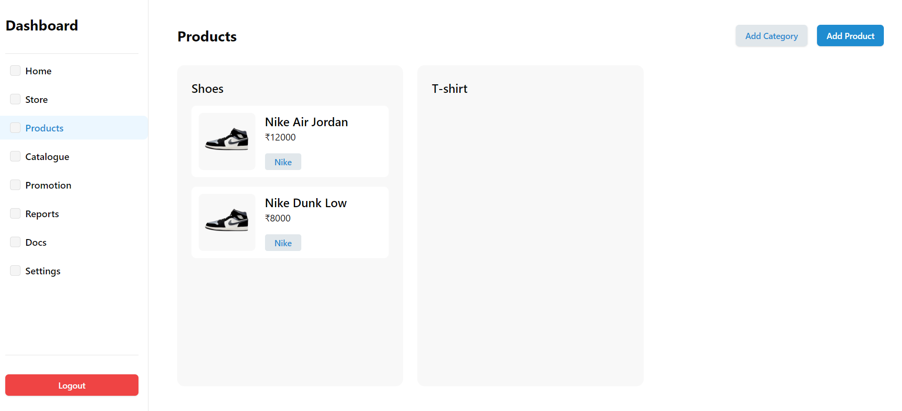

# Assignment: Wit by Bit

**Description**: Wit by Bit is a Next.js project that demonstrates modern web development practices with a fast and responsive design.

## Technologies Used

- **Next.js**: React framework for server-side rendering and static site generation.
- **Tailwind CSS**: Utility-first CSS framework for responsive design.
- **ShadCN UI**: Accessible, unstyled UI component library used for consistent UI.
- **TypeScript**: Typed JavaScript for enhanced developer experience.
- **Vercel**: Hosting and deployment platform for the project.

## Installation and Setup

### How to Install and Run Locally

1. Clone the repository:

   ```bash
   git clone https://github.com/amankashyap004/assignment-wit-by-bit.git
   ```

2. Navigate to the project directory:

   ```bash
   cd assignment-wit-by-bit
   ```

3. Install dependencies:

   ```bash
   npm install
   ```

4. Run the development server:

   ```bash
   npm run dev
   ```

5. Open [http://localhost:3000](http://localhost:3000) in your browser to view the application.

## Features

- **Login Functionality**: Mock admin login to access the dashboard.
- **Product Management**: Add, edit, and delete products and categories.
- **Responsive Design**: Built using Tailwind CSS for a seamless experience across devices.
- **Radix UI Components**: Utilizes Radix UI for buttons, inputs, and other UI components for a consistent user interface.

## Screenshots



## Live Demo and Repository

- **Live Demo**: [Assignment Wit by Bit](https://assignment-wit-by-bit.vercel.app/)
- **Repository**: [Assignment Wit by Bit](https://github.com/amankashyap004/assignment-wit-by-bit)

## Folder Structure

```
assignment-wit-by-bit/
├── public/
│   ├── images/
│   │   ├── dashboard.png
│   │   └── shoes-image.png
│   └── data.json
├── src/
│   ├── app/
│   │   ├── dashboard/
│   │   │   ├── Sidebar.tsx
│   │   │   ├── Tabs.tsx
│   │   │   ├── DashboardLayout.tsx
│   │   │   └── page.tsx
│   │   ├── favicon.ico
│   │   ├── layout.tsx
│   │   ├── page.tsx
│   │   └── globals.css
│   ├── components/
│   │   ├── ui/
│   │   │   ├── button.tsx
│   │   │   ├── input.tsx
│   │   │   ├── select.tsx
│   │   │   ├── switch.tsx
│   │   │   └── table.tsx
│   │   ├── product/
│   │   │   ├── AddProductForm.tsx
│   │   │   ├── AddCategoryModal.tsx
│   │   │   ├── ProductManagement.tsx
│   │   │   ├── ProductList.tsx
│   │   │   └── ProductCard.tsx
│   │   ├── Footer.tsx
│   │   └── Header.tsx
│   ├── lib/
│   │   └── utils.ts
│   ├── types/
│   └── index.ts
├── .eslintrc.json
├── .gitignore
├── next.config.mjs
├── package-lock.json
├── package.json
├── postcss.config.mjs
├── README.md
├── tailwind.config.ts
└── tsconfig.json
```

## Project Structure Explanation

- `public/`: Contains static assets and data files.
- `src/`: Main source code directory.
  - `app/`: Next.js App Router structure.
  - `components/`: Reusable React components.
    - `ui/`: UI components (buttons, inputs, etc.).
    - `product/`: Product-related components.
  - `lib/`: Utility functions and helpers.
  - `types/`: Typescript definitions.
  - `index.ts`: Main entry point for the project.
- `package.json`: Project package.json file.
- `README.md`: Project README.md file.

Feel free to contact me for any queries or suggestions.
